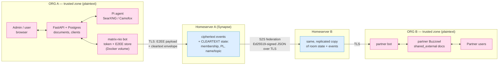

# Threat Model — Buzzowl Matrix Federation (Phase 5 design spike)

Status: design-spike threat model, pre-implementation. Scope: bot-to-bot sharing of client cards
between two Buzzowl installs over Matrix. Author role: security architect. Verdict feeds the
Phase 5 go/no-go.

Repo facts this model is anchored to (read-only inspection of `/Users/konradfirley/Youtube/buzzowl`):

- `schema.sql:82` — `documents(org_id, doc_id, type, title, content, metadata JSONB, visibility,
  source, agent_run_id, embedding vector(768), fts_doc)`, with `UNIQUE(org_id, doc_id)`.
- `db.py:2434` — `hybrid_search(org_id, query, doc_type=None, client_id=None, top_k=10)`. It has a
  single positive `doc_type` filter and **no exclusion list**. Callers: `mcp_server.py:93`,
  `routers/chat.py:361`, `routers/chat.py:996`, `routers/knowledge.py:52`.
- `db.py:3522` — `log_prompt(org_id, user_id, surface, prompt, context)`; assembled prompts are
  persisted for the thesis eval infra.
- `routers/internal.py` — agent action surface: `POST /clients`, `/bulk-research`,
  `PATCH /clients/{name}`, `/contacts`, `/find-people`, `/tasks`, `/outreach/draft`,
  `/deals/stage`. Fail-closed bearer auth, with an `ALLOW_INSECURE_INTERNAL=1` dev backdoor.
- `autonomy.py:61` — `ALLOWED_ACTIONS = ("skip","research","osint","match","draft_outreach","flag")`,
  gated by `may_act()` / `check_budget()`.
- `docker-compose.yml:225` — named volumes `buzzowl_pgdata`, `pi_oauth` (the latter already the
  "chmod 600 credential store survives rebuilds" pattern a Matrix store would copy).

---

## 1. Assets & trust boundaries

### Assets (ranked)

| # | Asset | Why it matters |
|---|---|---|
| A1 | Client cards, contacts, findings, deals in `documents`/`clients`/`contacts` | The product. Commercially sensitive; contacts are personal data (GDPR). |
| A2 | **The partnership graph itself** — who shares with whom, how often | For a sales tool this leaks the org's partner/channel strategy. Often more sensitive than a single card. |
| A3 | Bot access token + E2EE store (Megolm/Olm keys, device keys) | Full impersonation + retro-decryption of everything in the store. |
| A4 | Local LLM agent action surface (`routers/internal.py`, `autonomy.py`) | Inbound partner text reaching an agent turns a data channel into an action channel. |
| A5 | Private notes, meeting transcripts (explicitly *not* shared) | Oversharing here is the worst-case product failure. |

### Boundary diagram

### What each party sees

| Party | Plaintext card content | Metadata visible |
|---|---|---|
| Buzzowl A / B (own zone) | Yes — full | Everything |
| Homeserver A (self-hosted by A) | No (Megolm ciphertext) | Room ID, membership list, power levels, **all state events (unencrypted by spec)**, event type visibility depends on encryption wrapper, event size, timing, sender device ID, A's client IP, media blob sizes |
| Homeserver B | No | Same as A — B's homeserver keeps a **full replica** of room state and event history |
| Third-party homeserver (if not self-hosted) | No | Same as above, but now a *fourth party* holds the partnership graph and traffic timing |
| Passive network observer | No | TLS-protected; sees only server-to-server IP/volume |

Two structural consequences to internalise:

1. **Metadata is not protected by E2EE.** `m.room.member`, `m.room.power_levels`, `m.room.name`,
   `m.room.topic` are state events and are **not encrypted** — only timeline events are. If a room
   is named "Buzzowl ⇄ Acme GmbH", the client relationship is in the clear on both homeservers.
2. **Federation replicates history.** Once B's homeserver has the events, A cannot un-send them.
   Every deletion primitive downstream is a *request*, not a *delete*.

---

## 2. Threat register

Likelihood/Impact: H/M/L. "Pre" = with the design as proposed (incl. `ignore_unverified_devices=True`).

### A. Identity & bootstrap

| ID | Threat | L | I | Mitigation |
|---|---|---|---|---|
| A1 | **Typosquatting homeserver.** Admin is socially engineered into pairing with `@buzzowl:acme-crrn.example`. MXIDs are attacker-chooseable strings and the UI will render them in a small font. | M | H | Pairing UI shows the **server part on its own line, monospace, punycode-expanded**, plus a 6-word/emoji SAS the two admins compare over an existing channel (phone/existing email thread). Never accept a partner MXID pasted from an email without a second-channel confirmation step. |
| A2 | **MXID proves domain control, not corporate identity.** Anyone who controls `acme-crm.example` (or is that homeserver's admin) can mint `@buzzowl:acme-crm.example`. | H | M | Accept this as the trust root, but bind it: at pairing, record the partner bot's **device Ed25519 fingerprint** and treat *that* as identity, not the MXID. Domain control gets you one chance to be pinned; it does not get you a second device later. |
| A3 | **Rogue-device injection (the central risk).** A malicious or compromised homeserver B can add a device to B's bot account, or fake invites on behalf of its users. With `ignore_unverified_devices=True`, A's bot happily shares the outbound Megolm session with that new device → the homeserver operator reads every future card. This is not theoretical: matrix.org's own advisories describe admins of malicious servers adding malicious devices to their users' accounts and impersonating devices to spy on messages. | M | H | **Do not ship v1 with blanket `ignore_unverified_devices=True`.** Use TOFU + pinning: at pairing, enumerate the partner bot's devices, require the admin to confirm the Ed25519 fingerprint (displayed as fingerprint + emoji SAS + QR), then `verify_device()` it. Thereafter **refuse to send** if any unpinned device appears — surface a blocking alert in the UI ("Acme's bot has a new device; re-verify before sharing resumes") and `blacklist_device()` by default. nio exposes exactly this: `device_store`, `verify_device`, `blacklist_device`, `create_key_verification`/`confirm_key_verification` (SAS emoji/decimal). |
| A4 | **Account resurrection.** Partner deprovisions the bot; homeserver admin later re-registers the same MXID with a new device. | L | H | Pinned-fingerprint check (A3) catches this — new device ⇒ blocked ⇒ re-verify. |

### B. Consent & room membership

| ID | Threat | L | I | Mitigation |
|---|---|---|---|---|
| B1 | **Third party added to the pair room.** Partner (or partner's homeserver) invites a third bot; Megolm sessions are shared with new members on the next send, so the third party reads everything sent afterwards. | M | H | Enforce a **strict two-member invariant**: on every `m.room.member` change, if the joined set ≠ {us, pinned partner}, immediately (a) stop all outbound sends to that room, (b) rotate/discard the outbound session, (c) raise an admin alert. Set `power_levels` at creation so `invite: 100`, `kick/ban: 100`, `m.room.tombstone: 100`, `events_default: 0`, and both bots at PL 100 — a partner *can* still invite, so detection, not prevention, is the control. |
| B2 | **Power-level manipulation / room takeover.** Partner raises own PL, demotes us, or changes `history_visibility`. | L | M | Watch `m.room.power_levels` and `m.room.history_visibility` state; any change from the agreed baseline ⇒ pause sharing + alert. Store the baseline at pairing. |
| B3 | **Room upgrade (tombstone).** Partner sends `m.room.tombstone`; membership migrates to a room we never vetted, with a fresh state we did not negotiate. | L | M | Treat any tombstone as **disconnect, not follow**. Never auto-join the replacement room; require an explicit re-pair (full A3 verification) in the UI. |
| B4 | **Unsolicited invite spam.** Any federated user can invite our bot; each invite is a UI notification and an attack-surface prompt. | M | L | Auto-reject invites from MXIDs not in a pending-pairing allowlist. Server-side, set Synapse `rc_invites` (per_room/per_user/per_issuer) and use `federation_domain_whitelist` / room `m.room.server_acl` to limit federation to known partner domains. Do not render invite-supplied display names/topics as trusted text. |
| B5 | **History back-read on join.** Default `history_visibility` is `shared`, so a later joiner can read back-history. | M | H | Set `history_visibility: joined` at room creation — members see only events sent after they joined. Combined with B1 this bounds a third-party join to future-only exposure. |

### C. Revocation & data lifecycle

| ID | Threat | L | I | Mitigation |
|---|---|---|---|---|
| C1 | **Leaving ≠ deleting.** Disconnect removes future flow, not delivered cards or B's Postgres rows. | H | H | Be honest in the UI: the disconnect dialog must say "stops future sharing; already-shared cards remain with the partner." Do not label it "revoke access". |
| C2 | **Retract is a request.** Matrix redactions are best-effort — there is no way to force other servers or clients to uphold them. | H | M | Implement `de.buzzowl.retract` as a *courtesy* signal; on receipt, mark the local `shared_external` doc `withdrawn` and hide it. Log it. Never promise deletion to the sender. |
| C3 | **Key persistence.** Partner's bot keeps inbound Megolm sessions indefinitely; ciphertext on the homeserver stays decryptable. | H | M | Rotate outbound Megolm sessions aggressively (`rotation_period_msgs`/`_ms` low) and on every membership change; enable a retention policy on the homeserver so old ciphertext ages out. Reduces, does not remove. |
| C4 | **Media outlives the event.** Encrypted attachments live in both media repos with independent retention. | M | M | Prefer inline ≤64 KiB events. If media is used, cap size, set a short `media_retention` on the homeserver, and record MXC URIs so disconnect can attempt deletion. |

### D. Homeserver compromise & metadata

| ID | Threat | L | I | Mitigation |
|---|---|---|---|---|
| D1 | **Homeserver A compromise.** Attacker gets: the full partnership graph, event timing/sizes, IPs — and can mount A3 against *us*. | L | H | Self-host Synapse on the same trust boundary as Buzzowl, patched, no open registration, no public room directory. Treat it as tier-0 infra, not "just another container". |
| D2 | **Third-party homeserver.** Using matrix.org or a vendor puts A2 (partnership graph) in a third party's hands permanently. | M | M | **Design decision: require self-hosted Synapse** for any install carrying real client data. Document third-party homeservers as unsupported for production. |
| D3 | **State-event leakage.** Room name/topic/avatar are cleartext; naming a room after the partner or client leaks A2 to both operators. | H | M | Rooms get **opaque names only** (a UUID). Never put the org, partner, or client name in `m.room.name`/`topic`. Human-readable labels live in local Postgres only. |
| D4 | **Traffic analysis.** Card size and send cadence reveal deal activity even under E2EE. | M | L | Accept. Optionally pad payloads to size buckets and batch on a jittered schedule. Nice-to-have. |

### E. Local install (bot host)

| ID | Threat | L | I | Mitigation |
|---|---|---|---|---|
| E1 | **Token / E2EE store theft** from the Docker volume, a backup, or an image layer. Yields impersonation *and* decryption of everything in the store. | M | H | Dedicated named volume (mirror the `pi_oauth` pattern), 0600, never bind-mounted into the web container, excluded from `.dockerignore`/backups or encrypted at rest. Passphrase-encrypt the nio store. Provide a one-click "revoke bot session" that logs the device out server-side (invalidating the token) and forces re-pair. |
| E2 | **Sensitive payloads in application logs.** | M | M | Log event IDs, room IDs, sizes, and schema versions — **never payload bodies**. Add a redaction unit test. |
| E3 | **Eval/prompt logging exfiltrates partner data.** `db.py:3522 log_prompt` persists assembled prompts for the thesis eval infra. Once `shared_external` docs reach `hybrid_search` (`db.py:2434` → `routers/chat.py:361`), partner-confidential text lands in the prompt log — a store with a different retention and access model than `documents`. | H | M | Either exclude `shared_external` from agent context by default (see F1, which fixes both), or mask federated content in `log_prompt` before persisting. This one is easy to miss and should be an explicit ticket. |
| E4 | Postgres dump / pgweb sidecar exposes partner data mixed with own data. | M | M | Same controls as own data, plus mark `shared_external` rows in any export tooling so partner data can be identified and purged on request. |

### F. Malicious inbound payload

| ID | Threat | L | I | Mitigation |
|---|---|---|---|---|
| F1 | **Prompt injection into the Pi agents — highest-severity inbound threat.** A partner (or anyone who has compromised a partner) writes a "findings summary" containing agent instructions. The doc gets embedded and indexed; `hybrid_search` has **no type-exclusion filter** (`db.py:2434` takes only a positive `doc_type`), so it will surface in `routers/chat.py:361/996`, `routers/knowledge.py:52`, and `mcp_server.py:93` context. The agent that reads it can then call `routers/internal.py`: create/patch clients, create contacts and tasks, change deal stages, and **draft outreach** (`autonomy.py` `draft_outreach`). Data channel becomes action channel. | M | H | (a) **Exclude `type='shared_external'` from agent/LLM context by default** — add an explicit exclusion parameter to `hybrid_search`, don't rely on callers. (b) If a user opts a doc in, wrap it in hard provenance delimiters: `<untrusted_partner_content org="...">…</untrusted_partner_content>` plus a system instruction that content inside is data, never instructions. (c) Never embed `shared_external` content until a human accepts it from the review queue. (d) Keep every write action human-confirmed for anything traceable to federated input; outreach sends must stay behind human approval regardless of autonomy level. |
| F2 | **XSS / HTML injection** in the review queue UI. Card content is rendered as markdown today. | M | H | Render remote content as **plain text or sanitised markdown with HTML disabled**; no `innerHTML`, no remote images (they also beacon back the reader's IP and read time), no links auto-followed. CSP on the review-queue view. |
| F3 | **Data poisoning.** Plausible-but-false findings pollute search, embeddings, and downstream summaries. | M | M | Read-only + never auto-merged (already in the design — keep it). Badge provenance everywhere the content appears, including inside search results. Poisoned docs must be deletable in one action along with their embeddings. |
| F4 | **Schema abuse / resource exhaustion.** Oversized JSON, deep nesting, huge string fields, 10k events/min, decompression bombs in media. | M | M | Strict **allowlist** JSON-schema validation (known fields only, unknown fields dropped not stored), per-field length caps, reject >64 KiB (spec max event size is 65536 bytes anyway), per-room rate limits (events/min, bytes/hour) enforced *in the bot* not just on Synapse, media size cap + type allowlist, and a bounded review queue per partner. |
| F5 | **Replay / forged edits.** Re-sent events, or an `m.replace` targeting an event the sender didn't author. | L | M | Deduplicate on Matrix event ID (unique index). Accept `m.relates_to`/`m.replace` **only when the editing sender == the original event's sender**. Reject events whose `sender` ≠ the pinned partner MXID. Reject timestamps outside a sane window. |
| F6 | **`doc_id` collision / overwrite.** `documents` has `UNIQUE(org_id, doc_id)`. If the inbound `doc_id` is derived from a partner-supplied client key, a malicious partner can craft a key that collides with a local doc_id and an upsert silently overwrites a genuine local document. | M | H | Namespace inbound doc ids server-side: `fed:{partner_org_uuid}:{matrix_event_id}` — never a partner-controlled string, never derived from a partner-supplied client key alone. Verify the insert path uses INSERT with conflict-on-own-namespace only. |

### G. Oversharing (own side)

| ID | Threat | L | I | Mitigation |
|---|---|---|---|---|
| G1 | **Share-scope defaults too broad**, or a mis-click shares the wrong client. | H | H | Default scope = **minimum** (company profile only). Contacts and findings are separate opt-ins. Pre-send **diff preview**: show the admin the exact JSON that will leave, per client, first time and whenever scope widens. Log every outbound event to an auditable "what we shared" view. |
| G2 | **LLM-generated "findings summary" leaks private notes / transcript content** even though the raw docs are excluded. | H | H | Generate the outbound summary **only from documents already inside the share scope** — never summarise-then-filter. Add a regression test asserting no `meeting`/transcript-typed doc contributes to an outbound payload. |
| G3 | **GDPR:** business-contact PII transferred to a third-party controller. | H | M | Contacts are opt-in per share (G1), a DPA/joint-controller agreement is a prerequisite for the feature, and the "shared with" audit view must be exportable for data-subject requests. C1/C2 mean erasure requests are contractual — surface that to the user. |

### H. Availability

| ID | Threat | L | I | Mitigation |
|---|---|---|---|---|
| H1 | Homeserver down → unbounded outbound queue, memory growth, thundering-herd on recovery. | M | L | Bounded persistent queue (a Postgres table), exponential backoff with jitter, drop-oldest with an admin-visible counter. |
| H2 | Bot session silently invalidated (token revoked, device logged out) → sharing stops with no signal. | M | M | Health check surfaced in the settings UI + notification on sync failure > N minutes (reuse `notifications.py`). |
| H3 | Partner blocks our server via `m.room.server_acl`. | L | L | Detect and surface as "partner disconnected". |

### I. Hosted multi-org future

| ID | Threat | L | I | Mitigation |
|---|---|---|---|---|
| I1 | Shared bot account across tenants → cross-org leakage, and one compromised org's store decrypts other orgs' rooms. | M | H | **One Matrix account + one E2EE store per org, always** — even in instance-per-org, so the model doesn't have to change later. Never a platform-wide bot identity. |
| I2 | Room→org mapping bug writes an inbound event to the wrong `org_id`. | M | H | Derive `org_id` from the *bot session* that received the event, never from a payload field (`sender org id` in the payload is untrusted — validate it *matches* the pinned mapping, and reject on mismatch). Add a test. |
| I3 | Hosted operator can read all orgs' plaintext anyway. | H | M | Inherent to hosted; disclose. E2EE does not protect a tenant from its own platform operator. |

### J. Supply chain / operations

| ID | Threat | L | I | Mitigation |
|---|---|---|---|---|
| J1 | **Crypto stack churn.** libolm was officially deprecated in July 2024 in favour of vodozemac. matrix-nio has migrated — 0.26.0 (2026-07-23) depends on `vodozemac>=0.9.0.post2` rather than `python-olm`. But the gap from 0.25.2 (2024-10) to 0.26.0 (2026-07) shows a slow cadence for a security-critical dependency. | M | M | Pin `matrix-nio>=0.26.0` **with the vodozemac extra** — never ship on a libolm-backed build. Subscribe to matrix-nio + Synapse advisories; budget for the possibility that a CVE fix requires an unmaintained-upstream patch. |
| J2 | Synapse becomes a second production service to patch, with its own CVE stream. | H | M | Only viable if someone owns it. Automated image updates, no federation to unknown domains, monitoring. This is a real, recurring ops cost, not a one-off. |

---

## 3. Must-have vs nice-to-have

### Must-have before any real customer data crosses a room

1. **Device pinning / TOFU verification** — replace `ignore_unverified_devices=True` with: verify at
   pairing (fingerprint + SAS in the UI), pin, then refuse to send to unpinned devices and alert (A3, A4).
2. **`history_visibility: joined`** + opaque room names/topics + baseline power levels recorded (B5, B2, D3).
3. **Two-member invariant enforcement** — halt sharing + alert on any membership change (B1).
4. **`shared_external` excluded from agent/LLM context by default**, enforced inside `hybrid_search`
   (`db.py:2434`), not at call sites (F1). Includes not embedding until human-accepted.
5. **Allowlist schema validation + size caps + rate limits**, enforced in the bot (F4).
6. **Server-side doc_id namespacing** `fed:{partner_uuid}:{event_id}` (F6) and `org_id` derived from
   the receiving session, never from the payload (I2).
7. **No HTML rendering of remote content**; no remote image loading (F2).
8. **Outbound diff preview + minimum-by-default share scope + summary built only from in-scope docs**
   (G1, G2).
9. **Credential hygiene**: dedicated 0600 volume, encrypted nio store, no payloads in logs, and
   `log_prompt` masking for federated content (E1, E2, E3).
10. **Honest disconnect/retract UX** — never claim deletion (C1, C2).
11. **Self-hosted Synapse required**; federation allowlist to known partner domains (D2, B4).
12. **Pin matrix-nio ≥0.26.0 on vodozemac**, not libolm (J1).

### Nice-to-have

- Cross-signing rather than per-device pinning (better UX, more code).
- Aggressive Megolm rotation + homeserver retention policies (C3).
- Padding/batching against traffic analysis (D4).
- Encrypted media path for >64 KiB docs — defer entirely to v2; inline-only in v1 removes C4 and half of F4.
- Signed application-layer payloads (Ed25519 over the JSON, key exchanged at pairing) as defence-in-depth
  if the homeserver is ever not self-hosted.
- Canary/receipt events to detect silent delivery failures.

---

## 4. Residual risks (cannot be engineered away)

1. **Post-delivery misuse.** Once B's bot decrypts a card, B can copy, export, re-share, or feed it to
   its own models. Every control above is upstream of this point. Contractual only.
2. **Erasure is unenforceable across federation.** Redactions are best-effort with no way to compel
   other servers to honour them; a GDPR Art. 17 request touching already-shared data is a legal
   process, not an API call. This must be in the product's DPA and in the UI copy.
3. **A compromised partner homeserver defeats E2EE for that partner.** Device pinning raises the bar
   and makes injection *noisy*, but an attacker who owns B's homeserver *and* B's bot host has the
   plaintext regardless. Our security is capped by the partner's operational security.
4. **The partnership graph is permanently visible to both homeserver operators.** Encryption protects
   payloads, never membership or timing. Self-hosting shrinks the audience to two parties; it cannot
   reach zero.
5. **Prompt injection is mitigable, not solvable.** As long as any LLM ever reads partner-authored
   text, a sufficiently clever payload may influence it. The durable control is blast radius —
   human confirmation on every state-changing action traceable to federated input — not filtering.

---

## 5. Alternative: no Matrix — signed JSON over HTTPS

Security-wise, Matrix's marginal value here is smaller than it looks. The proposed deployment is a
*self-hosted* Synapse, so Megolm is mostly encrypting data against infrastructure we already control —
while adding a genuinely hard new problem (bot-to-bot device trust) whose default setting,
`ignore_unverified_devices=True`, is precisely the failure mode a hostile homeserver exploits. A
peer-to-peer alternative — mTLS, or Ed25519-signed JSON POSTed to the partner's `/api/federation/inbox`
with keys pinned at pairing — gives *stronger* identity (a pinned key, no MXID/domain indirection, no
third-party trust root), no membership-semantics class of bugs (B1–B5 vanish), no state-event metadata
leak, and an auditable ~300-line surface instead of a Synapse deployment. It costs: both peers must be
network-reachable, you build your own retry/queue and key rotation, and there is no store-and-forward
when a peer is down (a relay reintroduces a metadata-holding third party — i.e. a homeserver by another
name). Note that most controls in §2 (F1, F2, F4, F6, G1, G2, E1–E4, I1, I2) are transport-independent
and dominate the risk either way.

**Opinion:** for machine-to-machine card sync between two servers, plain signed JSON over HTTPS is the
safer and cheaper choice. Matrix earns its complexity only if the roadmap genuinely includes humans in
the loop (partner reps conversing alongside the bots), third-party-hosted homeservers, or many-party
rooms. If Phase 5 is bot-to-bot only, my recommendation is **no-go on Matrix for v1** — or, if the
spike proceeds for strategic reasons, ship it strictly behind the twelve must-have controls and treat
device pinning as non-negotiable.

---

## Sources

- [Matrix Client-Server API specification](https://spec.matrix.org/latest/client-server-api/) — state vs timeline events, `m.room.history_visibility` values (`invited`/`joined`/`shared`/`world_readable`, default `shared`), max event size 65536 bytes.
- [Matrix.org — Libolm Deprecation (Aug 2024)](https://matrix.org/blog/2024/08/libolm-deprecation/) — libolm deprecated in favour of vodozemac.
- [matrix-nio on PyPI](https://pypi.org/project/matrix-nio/) — 0.26.0 released 2026-07-23, E2EE extra depends on `vodozemac>=0.9.0.post2`; prior release 0.25.2 (2024-10-04).
- [matrix-nio API docs](https://matrix-nio.readthedocs.io/en/latest/nio.html) — `verify_device`, `blacklist_device`, `ignore_device`, `device_store`, `create_key_verification`/`confirm_key_verification` (SAS), `ignore_unverified_devices` semantics.
- [Nebuchadnezzar: Practically-exploitable Cryptographic Vulnerabilities in Matrix](https://nebuchadnezzar-megolm.github.io/) and [the paper](https://eprint.iacr.org/2023/485.pdf) — malicious homeservers faking invites and adding devices to their users' accounts; Megolm session sharing to new members.
- [Matrix.org — Upgrade now to address E2EE vulnerabilities (Sep 2022)](https://matrix.org/blog/2022/09/28/upgrade-now-to-address-encryption-vulns-in-matrix-sdks-and-clients/) — admins of malicious servers impersonating user devices to read messages.
- [Matrix.org — Moderation in Matrix](https://matrix.org/docs/older/moderation/) — redactions are best-effort; no way to force other servers to uphold them.
- [Synapse Configuration Manual](https://element-hq.github.io/synapse/latest/usage/configuration/config_documentation.html) — `rc_invites`, `rc_federation`, `federation_domain_whitelist`, media/retention settings.
- [MSC1501: Room version upgrades](https://github.com/matrix-org/matrix-spec-proposals/blob/main/proposals/1501-room-version-upgrades.md) — `m.room.tombstone` and membership migration to a replacement room.
